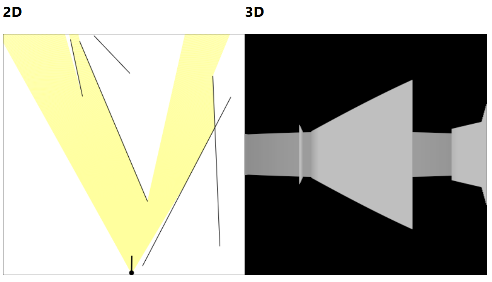

# 2D and 3D Raycasting with JavaScript Canvas

> Demo of 2D and 3D raycasting using JavaScript and an HTML canvas.

No libraries, all from scratch.

Resources/references:

- [Coding Challenge #145: 2D Raycasting ](https://www.youtube.com/watch?v=TOEi6T2mtHo)
- [Coding Challenge #146: Rendering Raycasting ](https://www.youtube.com/watch?v=vYgIKn7iDH8)

Inspired by one of [tsoding](https://www.twitch.tv/tsoding)'s streams where he implemented a 3D raycaster with canvas:

- [https://github.com/tsoding/raycasting](https://github.com/tsoding/raycasting)

## Running Locally

- Clone the repo.
- `cd src`
- `npx serve .`

View the app running at `localhost:3000`.