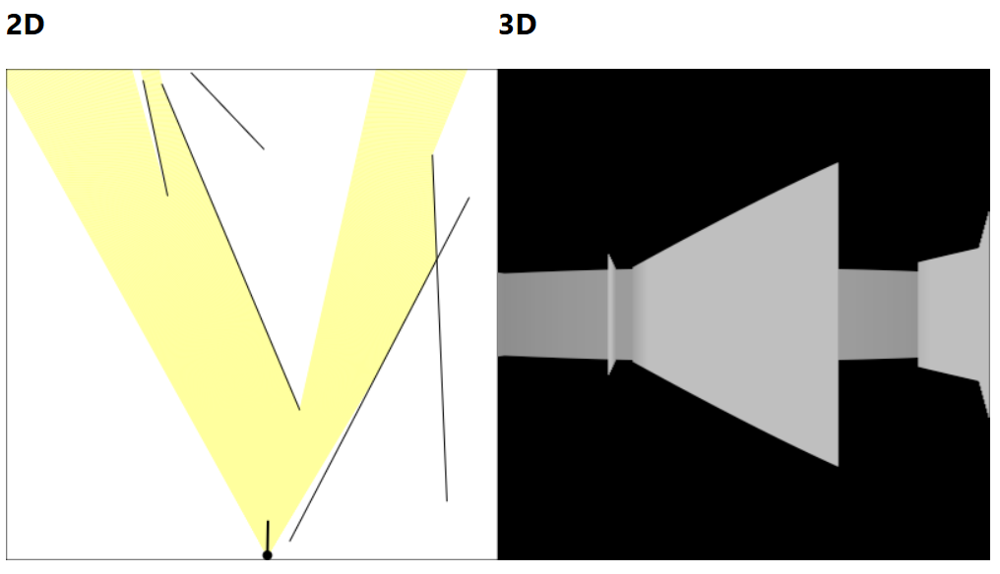

# 2D and 3D Raycasting with JavaScript

> Demo of 2D and 3D raycasting using TypeScript and an HTML canvas.

[View live demo](https://raycasting-from-scratch.netlify.app/)

No libraries, all from scratch.

Resources/references:

- [Coding Challenge #145: 2D Raycasting ](https://www.youtube.com/watch?v=TOEi6T2mtHo)
- [Coding Challenge #146: Rendering Raycasting ](https://www.youtube.com/watch?v=vYgIKn7iDH8)

Inspired by one of [tsoding](https://www.twitch.tv/tsoding)'s streams where he implemented a 3D raycaster with canvas:

- [https://github.com/tsoding/raycasting](https://github.com/tsoding/raycasting)

## Running Locally

Prerequisites:

- Node 20+
- Corepack

Steps:

1. Clone the repo.
2. Run `corepack enable`.
3. Run `corepack install`.
4. Run `pnpm install` to install dependencies.

Then run `pnpm dev` to start the dev server. View the app running on `localhost:5173`.
